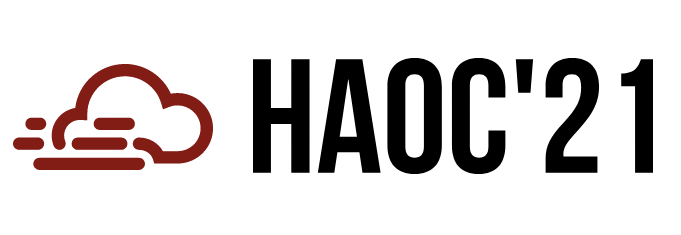

<h2 class="text-primary">Overview</h2>
Welcome to HAOC '21!

The 1st High Availability and Observability of Cloud Systems (HAOC) workshop,
in conjunction with <a href="https://2021.eurosys.org">EuroSys '21</a>, aims to 
discuss emerging techniques and the latest progress on a broad range of topics
related to the availability and observability of complex cloud systems,
including failure alerting, distributed tracing, eBPF techniques, online
debugging, instrumentation, automatic mitigation, testing in production, safe
deployment, AIOps, etc. The workshop addresses both academia and industry.  Its
objective is to advance the principles and practices on this subject by
creating a discussion forum that brings together researchers, engineers,
administrators, and practitioners. 

<h2 class="text-primary">News</h2>
* 2021-03-18: <a href="accepted_papers.html">Four papers</a> are accepted to appear in the workshop. Congratulations to all authors!
* 2021-02-19: Per a special request, the submission deadline is now Monday, February 22, 2021.
* 2021-02-11: The submission deadline is extended by one week!
* 2020-12-11: Workshop website is up

<h2 class="text-primary">Important Dates</h2>

<table class="table table-striped table-hover center-block">
<tr>
  <td>Paper Submission</td>
  <td><s>Wednesday, February 10, 2021</s>&nbsp;<b>Monday, February 22, 2021</b></td>
</tr>
<tr>
  <td>Notification to Authors</td>
  <td><b>Wednesday, March 17, 2021</b></td>
</tr>
<tr>
  <td>Final Paper Due</td>
  <td><b>Wednesday, March 31, 2021</b></td>
</tr>
<tr>
  <td>Workshop Date</td>
  <td><b>Monday, April 26, 2021 (8am - 1pm Pacific time)</b></td>
</tr>
</table>
