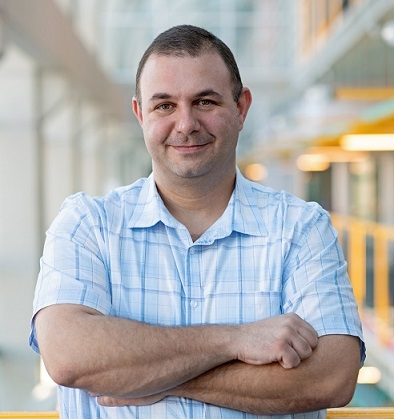

## Program
---
### April 26th, 2021

All times are in Pacific Time

<h4>Workshop Program</h4>

  

    
08:00 am - 09:00 am

    

      <b>Keynote</b>
    

    

      

        <a href="#">Title: TBA</a>
      

      

        Haryadi Gunawi, University of Chicago
      
      
    

  

  

    
09:00 am - 09:20 am

    

      <b>Introductions</b>
    

  

  

    
09:20 am - 09:30 am

    

      <b>Break</b>
    

  

  

    
09:30 am - 10:00 am

    

      <b>Paper Presentation Session I</b>
    

  

  

    
10:00 am - 10:30 am

    

      <b>Invited Talk I</b>
    

    

      <a href="#invited_talk_1_content" data-toggle="collapse" role="button" aria-expanded="false" aria-controls="invited_talk_1_content">
        On the Art of Wielding a Double-Edged Sword (or Finessing Modern Networks)
      </a>
    

    

      Samer Al-Kiswany, University of Waterloo
    

     
    

      

        

          Unprecedented advances in networking technology have introduced network configurability and programmability. However, this increase in network "softwarization" is a double-edged sword. On one hand, network softwarization facilitates the building of line-rate application-specific packet-processing logic. On the other hand, increased network softwarization (perhaps unsurprisingly) increases the frequency and complexity of network faults. 
        

        

          In this talk, I will discuss a peculiar type of a network fault that my group identified: partial network partitioning. First, I will present a comprehensive study of system failures caused by this type of fault. Our study reveals that the studied failures are catastrophic (e.g., lead to data loss) and are easily manifested. Second, I will present an analysis of fault-tolerance techniques for eight popular systems and highlight their shortcomings. Finally, I will present Nifty, a transparent communication layer that masks partial network partitions. Nifty overcomes the shortcomings of current fault-tolerance approaches and effectively masks partial partitions while imposing negligible overhead.
        

      

      

        

          
        

        

          

            Samer Al-Kiswany is an assistant professor at the David Cheriton School of Computer Science at the University of Waterloo, Canada. His research interests are in distributed systems, networking, and data management and processing engines. In particular, his work focuses on reconsidering systems design in light of recent changes in cloud applications and platforms. Samer received his PhD from the University of British Columbia in 2013. After earning his PhD, he joined the University of Wisconsin–Madison as a postdoctoral fellow. Dr. Al-Kiswany is the recipient of ten national and international awards, including the Killam Doctoral Fellowship and the NSERC Postdoctoral Fellowship.
          

        

      

    

  

  

    
10:30 am - 10:40 am

    

      <b>Break</b>
    

  

  

    
10:40 am - 11:10 am

    

      <b>Paper Presentation Session II</b>
    

  

  

    
11:10 am - 11:40 am

    

      <b>Invited Talk II</b>
    

  

  

    
11:40 am - 11:50 am

    

      <b>Break</b>
    

  

  

    
11:50 am - 12:50 pm

    

      <b>Panel (chair: John Wilkes)</b>
    

    

      <a href="#">Topic: TBA</a>
    

  

  

    
12:50 pm - 1:00 pm

    

      <b>Wrap-up</b>
    

  

